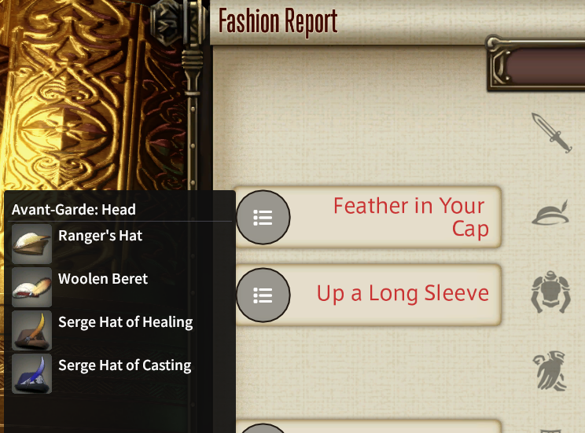

# Avant-Garde for Dalamud

Avant-Garde is a Dalamud plugin aiming to provide a comprehensive list for all hint categories in the Fashion Report minigame.
This plugin is a [crowdsourced project](#contributing), tracking gear pieces based on category and the slot they occupy.

    

### How does Fashion Report work?

Each week, a unique theme is presented along with hints for specific slots. These hints are not unique to the theme, and may appear across many different weeks. The goal is to reach a minimum of 80 out of 100 points. Points are calculated based on a number of factors:

-   You are awarded points for every piece of gear you have equipped, regardless of hint slots or accuracy. As such, the "base" score when being judged is 68.
-   For every hint on the right side of equipment (accessories), the base score goes up by 2.
-   Getting a gold medal for a hint on the left side of equipment awards 8 points. a hint on the right side awards 6 points.
-   For dye requirements, matching the general color of a dye for a slot awards 1 points. matching the exact color (say, Jet Black) awards 2 points.

It's worth noting that dyes are tied to the weekly theme, and thus cannot be predetermined. The plugin only cares about gear, and will not display any information about dyes.

## Contributing

You may contribute to the project by submitting gear pieces that match a certain category. You can fill the [Submission Form](https://forms.gle/hW9eFAvPm1ZkQFvG8), or reply to the forum post in the [Dalamud discord server](https://discord.gg/3NMcUV5) @ `#plugin-help-forum` _(will be made when/if the plugin gets accepted)_. Please attach a screenshot of the result screen to speed up the validation process.

A link to the data-tracker spreadsheet can be found [here](https://docs.google.com/spreadsheets/d/1b9NwL-Ba4tS0ROSy1_4HPfi7QSMQWuhXKqFSSY9Ovp4/edit?usp=sharing).

## Todo

-   Provide information on gear sources. Drop location? Cost from NPCs? Crafting requirement?

_This is simply an idea, and not something I have on high priority. However, if demand is high enough for this feature I will get to work on it right away, so do let me know!_
