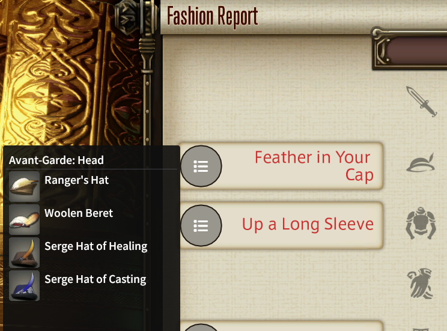

# Avant-Garde for Dalamud

Avant-Garde is a Dalamud plugin aiming to provide a comprehensive list for all hint categories in the Fashion Report minigame.
This plugin is a [crowdsourced project](#contributing), tracking gear pieces based on category and the slot they occupy.

    

### How does Fashion Report work?

Each week, a unique theme is presented along with hints for specific slots. These hints are not unique to the theme, and may appear across many different weeks. The goal is to reach a minimum of 80 out of 100 points. Below is a somewhat-deep dive into how score is calculated:

- You are awarded a "base" of 10 points for every piece of gear you have equipped. Accessories award 8 points instead.
- If a particular slot has a hint attached to it, the base points earned drop down to 2. Thus, by simply filling all slots (except for the offhand slot) the minimum possible score is 68.
- Points can be gained either by choosing the correct item for the hint or the correct dye for the slot.
- On slots with a hint attached, earning points upgrades the stamp/medal. Correct items grant 8/6 points (left vs right side of equipment) and will display a gold medal near them.
- Rarely, particular items may award a bonus point, for a total of 9/7 points.
- Lastly, for each slot, choosing the correct shade of a dye grants a point (determined by the icon of the dye item. as of 7.5 the logic still applies but is not visible). Choosing the exact dye grants 2 points.

It's worth noting that dyes are tied to the weekly theme, and thus cannot be predetermined. The plugin *currently* only cares about gear, and will not display any information about valid dyes.

## Contributing

You may contribute to the project by submitting gear pieces that match a certain category. You can fill the [Submission Form](https://forms.gle/hW9eFAvPm1ZkQFvG8), or reply to the forum post in the [Dalamud discord server](https://discord.gg/3NMcUV5) @ `#plugin-help-forum` ([Here](https://discord.com/channels/581875019861328007/1166794253553381456/1166794253553381456)). Please attach a screenshot of the result screen to speed up the validation process.

A link to the data-tracker spreadsheet can be found [here](https://docs.google.com/spreadsheets/d/1b9NwL-Ba4tS0ROSy1_4HPfi7QSMQWuhXKqFSSY9Ovp4/edit?usp=sharing).

## Todo / TBD

-   Dyes!
-   Provide information on gear sources. Drop location? Cost from NPCs? Crafting requirement? (Incl. localization)
-   **[Coming to a Testing branch near you!]** Automatic detection and submission of gear.
-   Switch to Native UI
